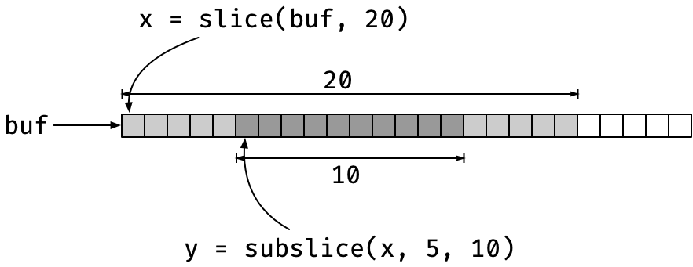

About those slices [I mentioned yesterday](https://mailund.dk/posts/macro-metaprogramming/), here's what's that about.

I'm working on some string algorithms and more straightforward C implementations than those I put in [my book](https://amzn.to/3pfzvdd).

I implemented all the algorithms and data structures I use in my string algorithm class in Python and Go in the spring,^[I'm toying with the idea of writing string algorithms books for those languages, but I have a long list of writing obligations, so I don't know if that will ever happen.] and I plan to implement them in Rust as soon as I get the time. Still, I'm also playing with the idea of reimplementing everything in C in a (perhaps) more accessible form.

Next time I teach my class, I would like to make one language mandatory for the projects. I get a range of weird stuff in the hand-ins, and it is a bit of a hassle since that makes automatic testing less automatic than I would like.

I have a set of scripts that generates test data, and I can plug in the students' programs after I adapt them to the interface the projects require (which is usually quite different from what I get). Still, I would much prefer if I could set up automatic testing *before* I get the reports.

In earlier classes, when I was teaching data science, I used GitHub and Travis to run automatic tests when the students handed in their solutions in the form of pull requests, and I would like to do something similar again. That way, I don't have to review their code until after the automatic tests have vouched for it. Right now, my tests fail half or more of the hand-ins, and I have to send error reports back to get updates. That is something that could be automated.

It is just a bit difficult to automate when they can use any language and any setup they want for the projects. I don't want to spend hours working out how to run Scalar or C# on Travis, and the students shouldn't spend their time on that either when they should be implementing suffix trees and Burrows-Wheeler transforms. No, it would be better if everyone used the same language, and I could give them a test suite.^[I am not entirely happy with the idea of me providing the tests because I know that they will consider those the only tests they need then. I would like them to learn how to write good tests, and we do discuss it in class (with varying results). If I provide tests, they won't think about it. Still, it is better than the current setup, I think.]

About 3/4 of the solutions I get today are in Python, so the natural choice for a mandatory language would be C.

No, hear me out. Python is a beautiful language, it is my language of choice for most of what I do, but it is not a good language for algorithmic programming.

It is slow, which I could live with, and the mix of user-defined functions written in Python and language extensions written in C makes reasoning about the performance a headache. A O(n<sup>2</sup>) algorithm that extensively uses calls to C code is usually faster than an O(n) algorithm in pure Python, at least for the range of input they test their code on, and that gives them a highly mistaken idea about performance.

Add to this that the performance of various operators is not immediately apparent. You and I know, of course, that `x[i]` is usually O(1) while `x[i:j]` is O(n), but it isn't obvious when the syntax is almost the same. And I see *a lot* of slicing in suffix trees, even though I have threatened physical violence to those who do it. (It doesn't stop them; I appear to be less intimidating than I had thought).

The strengths of Python make it the wrong choice for learning how to implement algorithms, in my opinion. The high-order features are hard to reason about computationally, and you have next to no control over the low-level representation of your data.

With Go or Rust or such, you get a language that is perhaps a little closer to the iron, and certainly where the performance is better, but they are not as close to the metal as I would like.

C is a simple language, the basic features you can learn in half an hour. The only difficulty with it for a novice, as I see it, is resource management, and they bloody-well need to learn about that at some point. Even if they never use a language without garbage collection ever again, knowing about resource management gives anyone a better understanding of how a program works and the costs of allocating and deallocating resources.

So, yeah, I'm thinking about making C a mandatory language for my class. I'll provide templates for each project, so it isn't too overwhelming and then let them implement the core of our algorithms.

Since the class is about string algorithms, the most important data structure would be strings. However, 0-terminated C strings are a bit tricky for pretty much all the algorithms we look at in class because we need to work on sub-strings. And while they might fool themselves into thinking that slicing in Python is efficient, I think that they can work out that explicitly allocating and copying strings to get sub-strings is not. And you cannot create 0-terminated strings any other way unless you destroy the string they sit inside.

No, a better representation for substrings is needed, something like those I wrote about in [Pointers in C](https://amzn.to/3n61cT3). And this time, I want a kind of strings that I can slice (but in constant time, like in Go), and just to keep it familiar to the Python programmers, I want to be able to index from the right using negative numbers. Also, I need these features for more than just strings; when I build suffix arrays, for example, I need to slice arrays of integers.

# Slices as wrapped buffers

I want my slices to be lightweight. I don't plan to allocate them on the heap but pass them around as values. That makes the memory-management much easier. Slices will just be wrappers around a buffer of allocated memory, and while that buffer must be managed, of course, the slices themselves do not.

Slices will just consist of a pointer into a buffer and a length. To get a sub-slice of such a beast, you can simply move the pointer and update the length in constant time. This is practically how slices are implemented in Go, except that Go also has a capacity for slices and allow them to be extended. I don't want any kind of `realloc()` on buffers I have pointers into, so that will be a no-no for my slices.



With slices over different types, I have a macro for defining them:

```c
#define CSTR_SLICE_TYPE(TYPE) \
    struct                    \
    {                         \
        signed long long len; \
        TYPE *buf;            \
    }
```

You might wonder why I use a (signed) `long long` for the length, where `size_t` might be more natural. It has to do with how I want to index into them. I will allow indexing the way Python does it, where -1 is the last element, -2 is the second-to-last element, etc. There, I need signed indices, and `long long` is the longest signed integer I have. If I made the slice length `unsigned long long` (or `size_t`), the slices could be larger than I can index, which would be silly.

You can immediately create a slice from a buffer with something like:

```c
typedef CSTR_SLICE_TYPE(char) sslice;

void foo(char *str)
{
   sslice x = { .buf = str, .len = strlen(str) }
   // use x for something
}
```

Here, `str` is supposed to be a 0-terminated C string, so we can get the length with `strlen(str)`, and we create a `sslice` (a slice over `char`) by setting the buffer and length.

A macro would be nice, so we wouldn't have to type in the struct every time we assign a slice

```c
#define CSTR_SLICE_INIT(BUF, LEN)  \
    {                              \
        .buf = (BUF), .len = (LEN) \
    }
```

which we could use as

```c
    sslice x = CSTR_SLICE_INIT(str, strlen(str));
```

No problem here, but if you want to assign to (not just initialise) a slice, you need to cast

```c
    sslice z;
    z = (sslice)CSTR_SLICE_INIT(x.buf, x.len / 2);
```

Not a big problem, of course, but I don't like this kind of redundancy. I have already provided the type for z; I also know that `x.buf` is `char`, and I don't want to give this information again.

I know how this will go if I want to change the type later. I will have to change a gazillion lines just because I changed a type, even though there is no change in the actual code.

I want a generic call

```c
   z = CSTR_SLICE(x.buf, x.len / 2);
```

that infers the type from `x.buf` (and of course checks that it matches `z`, but that will happen with the normal C type-check if `CSTR_SLICE()` returns the right type.

We want type-dispatch, picking the code to run based on the type information in the `buf` argument.

That is something we get for free with C++ templates, but it is not something that C supports.

The `_Generic()` feature (from C11) can do a little bit (very little) to help, though.

With `_Generic()`, you can write expressions such as

```c
  _Generic(x, type1: val1, type2: val2, …)
```

and based on `x`, you get the value that matches `x`'s type.

You cannot use a type for `x`, it has to be an expression, and all the values needs to be expressions as well. So, you cannot write

```c
#define CSTR_SLICE_TYPE(BUF) \
  _Generic(BUF, char *: sslice, int *: islice, …)
```

and use it in

```c
#define CSTR_SLICE(BUF, LEN) \
  (CSTR_SLICE_TYPE(BUF))CSTR_SLICE_INIT(BUF, LEN)
```

Because `sslice` and `islice` are types, the `_Generic()` call doesn't handle them.

Then, of course, you could try something like

```c
#define CSTR_SLICE(BUF, LEN)                    \
  _Generic((BUF),                               \
	  char *:(sslice)CSTR_SLICE_INIT(BUF, LEN), \
	  int *: (islice)CSTR_SLICE_INIT(BUF, LEN))
```

but here, `_Generic()` is downright mean. It requires that all the branches in the choices are semantically correct, meaning, among other things, that the type checker should be happy with them. If we give it a `char *` buffer, the `char *` branch creates a `sslice` struct, and all is good, but the `int *` branch creates an `islice` struct *from a `char *` buffer*, and that is a type error. So no go.

I think this is idiotic; the `_Generic()` call will only ever evaluate the right branch, so why does the type checking matter on the others? But it does, so this doesn't work.

You can do this instead:

```c
#define CSTR_SLICE(BUF, LEN)                             \
  _Generic((BUF),                                        \
	  char *:(sslice)CSTR_SLICE_INIT((void*)(BUF), LEN), \
	  int *: (islice)CSTR_SLICE_INIT((void*)(BUF), LEN))
```

We still dispatch on the type of `BUF`, but in the expressions, we cast it to `void *`. We can do that for all pointer types, and we can cast `void *` back to any pointer type again, so the type checker is happy with this (but only because we essentially throw away all the type information).

That was my first (working) solution, but I abandoned it again a little later. I thought I could do similar things with the indexing and slicing operations I wanted, using macros and dispatching using `_Generic()`, but I ran into two issues.

The first is well-known to anyone who writes macros: the arguments are evaluated multiple times if you use them more than once in the expansion. I have a test suite that generates random sub-slices, and throwing `rand()` into macro expansions means that we get a new value each time we evaluate the argument. 

That was an unpleasant experience (I had thought that multiple evaluations wouldn't be a problem since I had checked that the compiler optimised them away when the expressions were constant, but they weren't here).

The second issue is that if I want multiple macros for type-dispatching, I need to update all of them every time I add a new slice type. You don't get any help from the compiler; you just have to hunt down and find all the `_Generic()` dispatch macros.

To get around the first problem, evaluating parameters more than once, there are only functions. They don't re-evaluate arguments. It isn't an issue with the macro above, but for consistency, I changed `CSTR_SLICE()` when I added the other operations, so it dispatches to functions instead.

If you have a function for each slice, doing what `CSTR_SLICE()` does above, but for a specific type, you can use `_Generic()` to pick the right function.

```c
#define CSTR_SLICE(BUF, LEN)       \
   _Generic((BUF),                 \
       char *: cstr_new_sslice,    \
       int *:  cstr_new_islice)(BUF, LEN)
```

Here, we pick a function, `cstr_new_sslice` or `cstr_new_islice`, based on the type of `BUF`. The functions have different types; the first takes a `char *` as its first argument and the second an `int *`, but `_Generic()` doesn't care about that (for some reason, but it is good).

We do not call the functions inside the `_Generic()`, so we don't have to adapt the `BUF` type to the function with the `void *` trick. The `_Generic()` expression will only give us the function that matches the type of `BUF`, and then we apply that function *outside* the `_Generic()`, where we don't have to worry about the branches not taken.

This trick means that we need a function per slice type, but we can generate those:

```c
#define CSTR_SLICE_NEW_GENERATOR(NAME, TYPE)           \
    INLINE cstr_##NAME                                 \
        cstr_new_##NAME(TYPE *buf, long long len)      \
    {                                                  \
        return (cstr_##NAME)CSTR_SLICE_INIT(buf, len); \
    }
    
#define CSTR_DEFINE_SLICE(NAME, TYPE)          \
    typedef CSTR_SLICE_TYPE(TYPE) cstr_##NAME; \
    CSTR_SLICE_NEW_GENERATOR(NAME, TYPE)
    
CSTR_DEFINE_SLICE(sslice, char)
CSTR_DEFINE_SLICE(islice, int)
CSTR_DEFINE_SLICE(uislice, unsigned int)
```

I'll get to how I ended up dispatching on types without too much redundancy a little later. First, let's add a bit more functionality.

## Allocating and deallocating buffers

Now, the slices are supposed to just wrap buffers, so we can pass sub-strings and sub-arrays around in function calls. But we do, on occasions, have to allocate the underlying buffers.

I thought about keeping that entirely separated from slices. Still, it does make sense to me to keep the information about buffer lengths around when I allocate them (if, for nothing else, to make sure that I don't make a slice that goes beyond the end), and the slices are doing exactly that.

So, I added functionality for allocating and deallocating buffers. I generated functions for allocation, where I don't want the length argument to be evaluated more than once. When I deallocate, I want to set a slice's buffer to `NULL`, so I don't accidentally access memory that I'm no longer in charge of, so I use a macro for that.

```c
#define CSTR_BUFFER_ALLOC_GENERATOR(TYPE)                         \
    INLINE cstr_##TYPE cstr_alloc_buffer_##TYPE(long long len)    \
    {                                                             \
        cstr_##TYPE dummy; /* use dummy to get underlying type */ \
        return (cstr_##TYPE)CSTR_SLICE_INIT(                      \
            cstr_malloc_buffer(sizeof dummy.buf[0], (size_t)len), \
            len);                                                 \
    }

#define CSTR_FREE_SLICE_BUFFER(SLICE) \
    do                                \
    {                                 \
        free((SLICE).buf);            \
        (SLICE).buf = 0;              \
        (SLICE).len = 0;              \
    } while (0)
```

Below, I will also add a type dispatch to allocation with the same `_Generic()` approach as for `CSTR_SLICE()`. Notice the similarities in the names for the functions that create a new slice and that allocate a buffer, `cstr_[function name]_##TYPE`, where `[function name]` was `new` for `CSTR_SLICE()` and `alloc_buffer` for allocating buffers. I will rely on this convention when I generate the type dispatch code.

All types and functions have a `cstr_` prefix, so I don't pollute anyone else's namespace, and slice-specific functions will have a `_[slice type]` suffix, e.g., `_sslice` or `_islice`.

The generated allocator will look like this, for `sslice` and `char *` buffers:

```c
INLINE cstr_sslice
cstr_alloc_buffer_sslice(long long len)
{
    cstr_sslice dummy;
    return (cstr_sslice)CSTR_SLICE_INIT(
            cstr_malloc_buffer(
	            sizeof dummy.buf[0], (size_t)len),
            len);
}
```

The `cstr_malloc_buffer()` function (see below) takes two arguments, the size of objects in a buffer and the length of the buffer. I want the size of objects to always match what is in the slice type, so I get it from there. I cannot get a member from a type, but I can create a local variable that I don't use (except at compile time) and get the size of buffer elements from that. It will be optimised away by the compiler.

The allocation function is part of a trio I used to 1) abort the program if `malloc()` fails (it is unlikely, but I don't want to check allocation success everywhere, as that is a major hassle) and 2) compute the size of memory chunks based on the data I need.

```c
void *cstr_malloc(size_t size)
{
    void *buf = malloc(size);
    if (!buf)
    {
        fprintf(stderr, "Allocation error, terminating\n");
        exit(2);
    }
    return buf;
}

void *cstr_malloc_header_array(size_t base_size,
                               size_t elm_size,
                               size_t len)
{
    if ((SIZE_MAX - base_size) / elm_size < len) {
        fprintf(stderr, 
                "Trying to allocte a buffer longer than SIZE_MAX\n");
        exit(2);
    }
    return cstr_malloc(base_size + elm_size * len);
}

void *cstr_malloc_buffer(size_t obj_size, size_t len)
{
    // a buffer is just a flexible array in a struct that
    // has zero header...
    return cstr_malloc_header_array(0, obj_size, len);
}
```

The `cstr_malloc_header_array()` function is for dealing with flexible array members and is not important right now. It is for structs such as

```c
struct X {
  int some;
  char variables;
  float data[]; // flexible array member
};
```

where `data` can be a variable number of elements. The "header" for the allocation is the space from the top of the struct down to where `data` sits. That is the minimal space such a struct needs. After that, it needs some number of objects of size `sizeof data[0]`, (i.e., `sizeof(float)`).

You can get all the information you need from the struct, of course, and I have a macro for allocating flexible array structs:

```c
// Macro for getting the offset of a flexible member array
// from an instance rather than a type (as for
// offsetof(type,member)). This ensures we get the right
// type, to match the instance. The macro destroys the
// pointer variable by setting it to NULL, so use with care.
#define CSTR_OFFSETOF_INST(PTR, MEMBER) \
    (size_t)(&(PTR = 0)->MEMBER)

// Macro for allocating a struct with a flexible array
// element. Gets the offset of the array from a varialble,
// which requires less redundancy and potential for errors
// than offsetof() which requires a type.
// VAR is the struct variable (must be a pointer), FLEX_ARRAY
// is the name of the flexible array member.
#define CSTR_MALLOC_FLEX_ARRAY(VAR, FLEX_ARRAY, LEN) \
    cstr_malloc_header_array(                        \
        CSTR_OFFSETOF_INST(VAR, FLEX_ARRAY),         \
        sizeof(VAR->FLEX_ARRAY[0]), LEN)
```

Normally, you would get the header space as either `sizeof(struc X)`—which gives you the space `X` new without `data`, but which might be too much because of alignment—or `offsetof(struct X, data)`.

In `CSTR_MALLOC_FLEX_ARRAY()`, I could get `sizeof()` the struct from a variable of the type, but as I said, that might waste some memory. I cannot use `offsetof()` because it needs a type. If `VAR` is a `struct X *` variable, I could use `offsetof(*typeof(VAR), data)` or something to that effect, but `typeof()` is a compiler extension, so I won't necessarily have it.

The trick in `CSTR_OFFSETOF_INST()` gets me the offset of `data` from a pointer to the struct. It only works because I assign 0 to the pointer in the process, so it is destructive in a sense, but I only intend to use it when I assign to `VAR`, so it will be fine.

Anyway, I got side-tracked there. Back to slices.

## Indexing and slicing

For indexing and extracting sub-slices, we first need to handle negative indices the right way. There is nothing complicated to it; if you use a negative index, add the length to it to move it into a positive range:

```c
// When indexing x[i], if 0 <= i < x.len, we get x.buf[i], and
// if x.len < i <= -1 we get x.buf[x.len - abs(i)], i.e., we
// index from the back.
INLINE long long cstr_idx(long long i, long long len)
{
    // When i is negative we add it to len to get len - abs(i).
    long long j = i >= 0 ? i : len + i;
    assert(0 <= j && j <= len);
    return j;
}
```

This is the same indexing code for all slices, but the remaining operations vary by type, so we need to generate them.

```c
define CSTR_INDEX_AND_SLICING_GENERATOR(NAME, TYPE)                     \
    INLINE TYPE                                                          \
        cstr_idx_##NAME(cstr_##NAME x, long long i)                      \
    {                                                                    \
        return x.buf[cstr_idx(i, x.len)];                                \
    }                                                                    \
    INLINE cstr_##NAME                                                   \
        cstr_subslice_##NAME(cstr_##NAME x,                              \
                             long long i, long long j)                   \
    {                                                                    \
        i = cstr_idx(i, x.len);                                          \
        j = cstr_idx(j, x.len);                                          \
        assert(i <= j);                                                  \
        return (cstr_##NAME)CSTR_SLICE_INIT(x.buf + i, j - i);           \
    }                                                                    \
    INLINE cstr_##NAME                                                   \
        cstr_prefix_##NAME(cstr_##NAME x, long long i)                   \
    {                                                                    \
        return (cstr_##NAME)CSTR_SLICE_INIT(x.buf, cstr_idx(i, x.len));  \
    }                                                                    \
    INLINE cstr_##NAME                                                   \
        cstr_suffix_##NAME(cstr_##NAME x, long long i)                   \
    {                                                                    \
        return (cstr_##NAME)CSTR_SLICE_INIT(x.buf + cstr_idx(i, x.len),  \
                                            x.len - cstr_idx(i, x.len)); \
    }
```

You get `cstr_idx_[type]` for getting an index, `cstr_subslice_[type]` for getting a sub-sequence, `x[i:j]` in Python or Go, `cstr_prefix_[type]` for getting a prefix, `x[:i]`, and `cstr_suffix_[type]` for getting a suffix, `x[i:]`. The need the prefix and suffix functions because I cannot easily leave an index undefined as in Python or Go, it is `x[i:j]` and never `x[i:]` or `x[:j]` (unless you have some idea for how I could do that?)

There are also functions for printing and comparing slices. They are all generated the same way, so I don't think there is anything new to that, and I won't show the code. Let's just stop here, create some slices

```c
#define CSTR_DEFINE_SLICE(NAME, TYPE)          \
    typedef CSTR_SLICE_TYPE(TYPE) cstr_##NAME; \
    CSTR_SLICE_NEW_GENERATOR(NAME, TYPE)       \
    CSTR_BUFFER_ALLOC_GENERATOR(NAME)          \
    CSTR_INDEX_AND_SLICING_GENERATOR(NAME, TYPE)

CSTR_DEFINE_SLICE(sslice, char)
CSTR_DEFINE_SLICE(islice, int)
CSTR_DEFINE_SLICE(uislice, unsigned int)
```

and move on to how I dispatch on types.

# Type dispatching

We want operations, `M(x, y, z)`, where `M` dispatches to the right function based on `x`, and then call that function. So, for example, we should be able to generate a new slice from a buffer and a length as

```c
char *c_buf = /* something */;
int *i_buf = /* something */;

cstr_sslice x = CSTR_SLICE(c_buf, 42);
cstr_islice y = CSTR_SLICE(i_buf, 42);
```

where `CSTR_SLICE(c_buf, 42)` becomes `cstr_new_sslice(c_buf, 42)` because `c_buf` is `char *` and `CSTR_SLICE(i_buf, 42)` becomes `cstr_new_islice(i_buf, 42)` because `i_buf` is `int *`, and we should be able to write

```c
cstr_sslice z = CSTR_SUBSLICE(x, 13, 31);
cstr_islice w = CSTR_SUBSLICE(y, 13, 31);
```

where `CSTR_SUBSLICE(x, 13, 31)` becomes `cstr_subslice_sslice(x, 13, 31)` because `x` has type `cstr_sslice` and `CSTR_SUBSLICE(y, 13, 31)` becomes `cstr_subslice_islice(y, 13, 31)` because `y` has type `cstr_islice`.

Yes, we could just use the functions directly, but if you change the type of a slice later, there are a *lot* of places where you need to change function names. The compiler helps you find them because the type checker will complain, but it is still a hassle, and we *can* dispatch based on the type, so we don't need to pick the right functions ourselves.

We need to use `_Generic()`, and we will use it to pick an appropriate function based on the first argument. The main macro for achieving this looks like this:

```c
#define CSTR_SLICE_DISPATCH(X, MAP_TYPE, FUNC, ...) \
    _Generic((X), CSTR_DISPATCH_TABLE(FUNC, MAP_TYPE))(__VA_ARGS__)
```

The `X` parameter is the object we dispatch on. The `MAP_TYPE` will determine whether we are dispatching on a slice (with `MAP_TYPE = SLICE`) or the underlying base type (with `MAP_TYPE = BASE`). So, for `CSTR_SLICE(buf, len)` we want to use `MAP_TYPE = BASE` because `buf` will have the base type, e.g., `char *` or `int *`, but for `CSTR_SUBSLICE(x, i, j)` we will dispatch on the slice type, `MAP_TYPE = SLICE` because `x` should be a slice.

The `FUNC` argument defines the function. For `cstr_new_sslice` or `cstr_alloc_buffer_sslice`, `FUNC` would be `new` and `alloc_buffer`, respectively. The remaining parameters, `…`, are passed to the function we dispatch to.

This is how we would use `CSTR_DISPATCH` to define operations:

```c
// Dispatch on base type to call the "new" function
// with arguments (BUF, LEN)
#define CSTR_SLICE(BUF, LEN) \
    CSTR_SLICE_DISPATCH(BUF, BASE, new, BUF, LEN)

// Dispatch on slice type to call "alloc_buffer"
// with argument LEN
#define CSTR_ALLOC_SLICE_BUFFER(S, LEN) \
    CSTR_SLICE_DISPATCH(S, SLICE, alloc_buffer, LEN)
    
// Dispatch on slice type to index and sub-slice
#define CSTR_IDX(S, I) \
    CSTR_SLICE_DISPATCH(S, SLICE, idx, S, I)
#define CSTR_SUBSLICE(S, I, J) \
    CSTR_SLICE_DISPATCH(S, SLICE, subslice, S, I, J)
#define CSTR_PREFIX(S, I) \
    CSTR_SLICE_DISPATCH(S, SLICE, prefix, S, I)
#define CSTR_SUFFIX(S, I) \
    CSTR_SLICE_DISPATCH(S, SLICE, suffix, S, I)
```

We need to provide `_Generic()` with the type-to-function table to make the dispatching code work, which is what the `CSTR_DISPATCH_TABLE()` macro does.

It needs a mapping from each type, slice or base, to a function, and the different slice types are hardwired in it. I'm not happy with that but see below.

Anyway, this is what it looks like:

```c
#define CSTR_DISPATCH_TABLE(FUNC, MAP_TYPE)             \
    CSTR_DISPATCH_MAP(sslice, char, FUNC, MAP_TYPE),    \
    CSTR_DISPATCH_MAP(islice, int, FUNC, MAP_TYPE),     \
    CSTR_DISPATCH_MAP(uislice, unsigned int, FUNC, MAP_TYPE)
```

There is a call to `CSTR_DISPATCH_MAP()` for each slice type. The first two arguments are the slice type and the base type, then it gets the `FUNC` name and the mapping type (which should be `BASE` or `SLICE`).

We can then dispatch to separate macros based on the mapping type using concatenation:

```c
#define CSTR_DISPATCH_MAP(STYPE, BTYPE, FUNC, MAP_TYPE) \
    CSTR_DISPATCH_MAP_##MAP_TYPE(STYPE, BTYPE, FUNC)
```

so we will either call `CSTR_DISPATCH_MAP_BASE(STYPE, BTYPE)` or `CSTR_DISPATCH_MAP_SLICE(STYPE, BTYPE)` based on what `MAP_TYPE` was. Those macros, fortunately, are quite simple. We need a slice or base type (`STYPE` or `BTYPE` on the left of a colon and the function we dispatch to (`cstr_[FUNC]_[STYPE]`) on the right:

```c
#define CSTR_DISPATCH_MAP_BASE(STYPE, BTYPE, FUNC) \
    BTYPE * : cstr_##FUNC##_##STYPE
#define CSTR_DISPATCH_MAP_SLICE(STYPE, BTYPE, FUNC) \
    cstr_##STYPE : cstr_##FUNC##_##STYPE
```

That's it; that's static type dispatching for slices.

I am reasonably satisfied with this solution. Generating functions is always a bit tricky, in the unlikely event of a bug, because debugging it is annoying. But I try to avoid making mistakes, and then it shouldn't be a problem.

What really annoys me isn't that, though, but the redundancy in defining slice types and dispatching. I need to define all the types and generate all the code in one place, and then I also need to add the same information to the `CSTR_DISPATCH_TABLE()`. It isn't a major problem; I define the table right after the `CSTR_DEFINE_SLICE()` calls, so I have the code in the same place, but it still annoys me.

I would love to generate the types *and* the dispatch table in the same macro call, but it isn't easy. You cannot define new macros inside macro expansions, so I cannot build `CSTR_DISPATCH_TABLE()`.

I could, however, define the slice names and base types in a macro, use meta-programming to run through that to generate the type, and use meta-programming to generate the dispatch table when I need it. That way, I would get the information from the same place for each, and there would only be one place to add or change slice types.

That is where I went down the meta-programming rabbit hole [I wrote about yesterday](https://mailund.dk/posts/macro-metaprogramming/).

I'm pretty sure that it can be done, but mapping over pairs of values, parsing along function and mapping type, and all that jive gave me some pretty nasty code, and I decided that it wasn't worth it.

And I don't think it is. Adding it to this simple string library will make the code infinitely more complicated with practically no gain to it. I would love to figure out a solution anyway, but it is probably something I will just do for fun.

But it could be fun.

## UPDATE

Ok, I was stupid. I was thinking that to specify the slice types one place only, I would have to map a function over a list of types. Well, I do have to do that, but it is easier to write a macro that applies a function to each type than a macro that can map a function over them…

If I define a macro like this:

```c
#define CSTR_MAP_SLICE_TYPES(F, SEP, ...) \
  F (sslice, char, __VA_ARGS__) SEP       \
  F (islice, int, __VA_ARGS__) SEP        \
  F (uislice, unsigned int, __VA_ARGS__)
#define CSTR_COMMA_SEP() ,
```

I can apply any macro `F` over all the slice types. I allow additional arguments (because I need those for dispatching), and I have a separator between applications, because I need space when defining types and I need a comma when I dispatch. The `CSTR_COMMA_SEP()` macro expands to a comma, so I can use it when calling `CSTR_MAP_SLICE_TYPES()` (you cannot directly use a comma, since that is a argument separator, but you can call the macro with `CSTR_COMMA_SEP()`.

Now, I can generate the code for all types using

```c
CSTR_MAP_SLICE_TYPES(CSTR_DEFINE_SLICE, /* no sep */)
```

where I don't need to list the various types again, and with a little bit of macro hacking

```c
#define CSTR_DISPATCH_MAP_BASE(STYPE, BTYPE, FUNC) \
  BTYPE * : cstr_##FUNC##_##STYPE
#define CSTR_DISPATCH_MAP_SLICE(STYPE, BTYPE, FUNC) \
  cstr_##STYPE : cstr_##FUNC##_##STYPE
#define CSTR_DISPATCH_MAP(STYPE, BTYPE, FUNC, MAP_TYPE) \
  CSTR_DISPATCH_MAP_##MAP_TYPE(STYPE, BTYPE, FUNC)

#define CSTR_DISPATCH_TABLE(FUNC, MAP_TYPE) \
  CSTR_MAP_SLICE_TYPES(CSTR_DISPATCH_MAP, CSTR_COMMA_SEP(), FUNC, MAP_TYPE)

// Dispatch a function based on the type of X
#define CSTR_SLICE_DISPATCH(X, MAP_TYPE, FUNC, ...) \
  _Generic((X), CSTR_DISPATCH_TABLE(FUNC, MAP_TYPE))(__VA_ARGS__)
```

I can generate the dispatch tables using `CSTR_MAP_SLICE_TYPES()` again. Now, the only place I need to modify if I want to change the slice types is in `CSTR_MAP_SLICE_TYPES()`.

