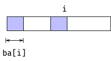
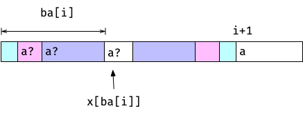
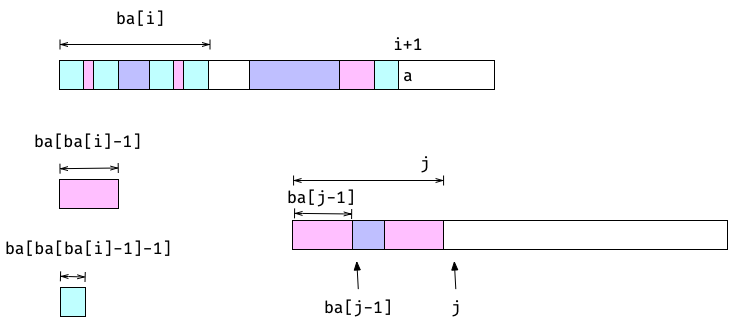
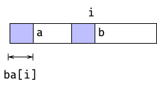

Following on my [previous post](https://mailund.dk/posts/some-simple-string-search-implementations/) I set out to implement the Knuth-Morris-Pratt algorithm.

This algorithm shifts the pattern `p` along `x`, exploiting the structure in `p` to skip positions we know cannot match. To do this, it uses a so-called *border array* that we need to pre-compute. 

A *border* of a string is a proper prefix and suffix. The “proper” means that it cannot be the full string but can be empty.


The *border array* of a string gives you the length of the longest border at every prefix. That is, for every index `i` in a string `i`, you have a prefix of the string, `x[..i]`. That prefix has one or more borders (there is always at least one because the empty string is a proper prefix and suffix), and `ba[i]` is the length of the longest.



When you are building the border array, you do it left-to-right. The border for the first index, since borders have to be proper, has to be empty, so the first index is zero, and the remaining we can build from the borders on the left. Whenever we move from index `i` to `i+1`, we need to find a border. Whatever letter is at `x[i+1]`, the border needs to end with that (unless it is empty). So you scan through candidates, which will be the borders of `x[..i]`, and see if you can expand them.



In the figure, the indexing seems slightly off, but if we are indexing from zero, then index `ba[i]` is one past the border of `x[..i]`. The length is always one past the last index. The figures would be cleaner if we index from one, but then we get into a different mess later.

To do this scan, you don’t have to keep track of all the borders of `x[..i]`. The structure of borders mandates that the second-longest border (which must be a border, duh) must also be a border of the longest border. So to get the second longest border, you can ask for the longest border of the longest border. You can continue with this reasoning until you reach the empty border.



This might look like a quadratic time algorithm—for each index `i`, you have to search through all the previous borders, of which there could be _O(i)_, but an amortisation argument shows that you cannot have long scans that often. If you have to scan down far, you end up with a short border, so you cannot do a long search next time.

More formally, consider the current border a potential function. You can only increase the potential by one in each iteration, and you cannot reduce the potential below zero, so you end up with a linear time algorithm.

The KMP algorithm doesn’t originally look like what I have implemented below, but it is pretty close. You can reformulate it as essentially running the border array algorithm on the string `p$x` that consists of the pattern you want to search for, `p`, a “sentinel” character that doesn’t appear in `p` or `x`, and then the string we search in. If we build the border array over `p`, we can scan through it and find all the borders of length `m=|p|` that lands in the `x` part. The sentinel prevents longer borders, and borders of length `m` are the longest we can get. Plus, where we have a border of length `m`, we have a bit of `x` that matches `p`.

This algorithm, by the way, works fine, runs in linear time, and is simpler than the original KMP, so it is not a bad approach to searching in the simple case we consider here. It is _almost_ the algorithm the way it was originally formulated and we just came to it from a different direction.

In the original algorithm, though, there is one more trick. We are going to match `p` against all positions in `x` and make a jump whenever we have a mismatch, and this jump just happens to be the same kind of jump we do when we build the border array. However, since we are trying to match, rather than building the border array, we can jump a little further with a little more preprocessing. We are going to use a “strict” border array, where we require that the borders we have cannot be followed by the same character as the one that follows `x[..i]`.



By looking one ahead, we can jump a little further. It doesn’t change the asymptotic running time but is a speedup.

Anyway, enough theory; let’s get to the hacking!

### Python

Building the border array in Python is as straightforward as you could wish. Nothing interesting here.

```python
def border_array(x: str) -> list[int]:
    """Construct the border array for x."""
    ba = [0] * len(x)
    for j in range(1, len(x)):
        b = ba[j - 1]
        while b > 0 and x[j] != x[b]:
            b = ba[b - 1]
        ba[j] = b + 1 if x[j] == x[b] else 0
    return ba


def filter_border(p: str, ba: list[int]) -> list[int]:
    """
    Construct the strict border array for p.

    A struct border array is one where the border cannot
    match on the next character. If b is the length of the
    longest border for p[:i+1], it means p[:b] == p[i-b:i+1],
    but for a strict border, it must be the longest border
    such that p[b] != p[i+1].
    """
    for j, b in enumerate(ba[:-1]):
        if p[b] == p[j + 1] and b > 0:
            ba[j] = ba[b - 1]
    return ba
```

Building the strict version of the border array is the simplest way I know, and it gives you linear time preprocessing for both arrays. So that is what I will go with everywhere.

There is also nothing unexpected about the KMP implementation, either. As I have implemented it, in Python and in the other languages, I am not just building the border array of `p$x`, but I have the border array of `p` and at every prefix I have matched of `x` I start out by shifting the matching position down with the border array jumps we had in the border array construction. Once I have the longest border I can find, I try to add one more character match, and if that takes me to the end of `p` I have a full match. After a full match, I have to start again from the longest border of the full `p`, so I update that after returning from the yield.

```python
def kmp(x: str, p: str) -> Iterator[int]:
    """Run the Knuth-Morris-Pratt algorithm."""
    if len(x) == 0 or len(p) == 0:
        return

    j = 0
    ba = filter_border(p, border_array(p))
    for i, a in enumerate(x):
        # shift down pattern...
        while a != p[j] and j > 0:
            j = ba[j - 1]

        # match one up, if we can...
        if a == p[j]:
            j += 1

        if j == len(p):
            yield i - len(p) + 1
            j = ba[j - 1]
```

### C

For C, I didn’t expect any problems with the implementation, and there weren’t. I expected problems with how I would design the algorithm for use, and there were.

First, building the border array. There is nothing new here except for syntax. I don’t have the length of C strings, so I use the `'\0'` sentinel instead, but otherwise, it is easily recognisable as the same algorithm we have in Python.

```c
void border_array(const char *p, int *b) {
  // Classical border array
  b[0] = 0;
  int j = 0;
  for (int i = 1; p[i]; i++) {
    while (j > 0 && p[i] != p[j])
      j = b[j - 1];
    if (p[i] == p[j])
      j++;
    b[i] = j;
  }
  // Making it strict
  if (!p[0] || !p[1])
    return;
  for (int i = 1; p[i + 1]; i++)
    if (b[i] && p[b[i]] == p[i + 1])
      b[i] = b[b[i] - 1];
}
```

My problem is with how you would use this algorithm. In C, we don’t have any automatic resource management, so the border array we allocate has to be handled somehow.

For a short time, you were allowed to allocate arrays with dynamic size on the heap, but now that is compiler-dependent (and probably for good reason). That means we need to heap allocate, and that means we need to free again.

If I want to follow the `for (init; test; inc)` pattern, where do initialisation and deallocation go? If `init` should return a pointer into `x` as with the naïve algorithm, how would I return a reference to the allocated array? Should I automatically deallocate when the loop is completed (that was quickly rejected as there is no guarantee that a user wouldn’t break out of the loop early)? It is a mess. That’s why we love C.

I decided that you would have to initialise and free an iterator yourself. It feels like the C spirit. You could still use the `for` loop pattern, but you would need to use an initialised iterator. Something like this:

```c
  struct kmp_iter iter = kmp_iter_init(x, p);
  for (const char *hit = kmp_iter_next(&iter); 
       hit; hit = kmp_iter_next(&iter)) {
    ...
  }
  kmp_iter_free(&iter);
```

Once that was decided, implementing it was simple. Put all you need in the `kmp_iter` structure and go from there.

```c
struct kmp_iter kmp_iter_init(const char *x, const char *p) {
  int *b = malloc(strlen(p) * sizeof *b);
  border_array(p, b);
  struct kmp_iter iter = {.x = x, .p = p, .b = b, .i = 0, .j = 0};
  return iter;
}
const char *kmp_iter_next(struct kmp_iter *iter) {
  if (!iter->x[0] || !iter->p[0])
    return NULL;

  for (; iter->x[iter->i]; iter->i++) {
    // Shift pattern down
    while (iter->j > 0 && iter->x[iter->i] != iter->p[iter->j])
      iter->j = iter->b[iter->j - 1];

    // Move one step forward (if we can)
    if (iter->x[iter->i] == iter->p[iter->j])
      iter->j++;

    // If we reached the end of the pattern, we found a match
    if (iter->p[iter->j] == '\0') {
      const char *result = iter->x + iter->i - iter->j + 1;
      // Updating iter for next iteration
      iter->j = 0;
      iter->i++;
      return result;
    }
  }
  return NULL;
}
void kmp_iter_free(struct kmp_iter *iter) { free(iter->b); }
```

Any of the proposed solutions for registering deallocation (implemented in compiler-specific ways if you don’t care about the standard) would have given me a nicer solution, but I work with what I (decide that I) have got.

### Go

The Go solution is downright trivial by now. If I’m going with the callback solution, there is only one way to go here, so that is the way I took.

```go
func Borderarray(x string) []int {
	ba := make([]int, len(x))
	for i := 1; i < len(x); i++ {
		b := ba[i-1]

		for {
			if x[b] == x[i] {
				ba[i] = b + 1
				break
			}

			if b == 0 {
				ba[i] = 0
				break
			}

			b = ba[b-1]
		}
	}

	return ba
}

func StrictBorderarray(x string) []int {
	ba := Borderarray(x)
	for i := 1; i < len(x)-1; i++ {
		if ba[i] > 0 && x[ba[i]] == x[i+1] {
			ba[i] = ba[ba[i]-1]
		}
	}

	return ba
}
```

```go
func Kmp(x, p string, callback func(int)) {
	if x == "" || p == "" {
		return
	}

	ba := StrictBorderarray(p)

	var i, j int

	for i < len(x) {
		// Match...
		for i < len(x) && j < len(p) && x[i] == p[j] {
			i++
			j++
		}
		// Report...
		if j == len(p) {
			callback(i - len(p))
		}
		// Shift pattern...
		if j == 0 {
			i++
		} else {
			j = ba[j-1]
		}
	}
}
```

### Rust

Finally, Rust.

I’m going to ignore all the alphabet stuff, that I deeply regret getting into, but I used it in this implementation anyway (just so I got something out of it).

And _if_ you ignore that, the implementation is much like the others above. You just have better memory management than what C provides.

Building the arrays I don’t think you have much wiggle room with:

```rust
pub fn border_array<Char>(p: &Str<Char>) -> Vec<usize>
where
    Char: CharacterTrait,
{
    let m = p.len();
    let mut ba = vec![0; m];
    let mut j = 0;
    for i in 1..m {
        while j > 0 && &p[i] != &p[j] {
            j = ba[j - 1];
        }
        if &p[i] == &p[j] {
            j += 1;
        }
        ba[i] = j;
    }
    ba
}

pub fn strict_border_array<Char>(p: &Str<Char>) -> Vec<usize>
where
    Char: CharacterTrait,
{
    let mut ba = border_array(p);
    for j in 1..(ba.len() - 1) {
        let b = ba[j];
        if b > 0 && p[b] == p[j + 1] {
            ba[j] = ba[b - 1];
        }
    }
    ba
}
```

And since I’m still using an explicit Iterator, I have something that resembles the C solution the most.

```rust
struct KMPSearch<Char: CharacterTrait> {
    /// The string we are searching in
    x: Str<Char>,
    /// The pattern we are searching for
    p: Str<Char>,
    /// The border array of the pattern
    ba: Vec<usize>,
    /// The current index in the string
    x_index: usize,
    /// The current index in the pattern
    p_index: usize,
}

impl<Char: CharacterTrait> KMPSearch<Char> {
    fn new(x: Str<Char>, p: Str<Char>) -> KMPSearch<Char> {
        let ba = strict_border_array(&p);
        KMPSearch {
            x,
            p,
            ba,
            x_index: 0,
            p_index: 0,
        }
    }
}

impl<Char: CharacterTrait> Iterator for KMPSearch<Char> {
    type Item = usize;

    fn next(&mut self) -> Option<usize> {
        let KMPSearch {
            x,
            p,
            ba,
            x_index: i,
            p_index: j,
            ..
        } = self;

        let n = x.len();
        let m = p.len();

        while *i < n {
            // Shift pattern until it matches the border
            while *j > 0 && &x[*i] != &p[*j] {
                *j = ba[*j - 1];
            }

            // Move one step forward (if we can)
            if &x[*i] == &p[*j] {
                *j += 1;
            }

            // Move to the next position (saving it for the next call to next)
            *i += 1;

            // Return if a match was found
            if *j == m {
                *j = ba[*j - 1];
                return Some(*i - m);
            }
        }
        None
    }
}
```

