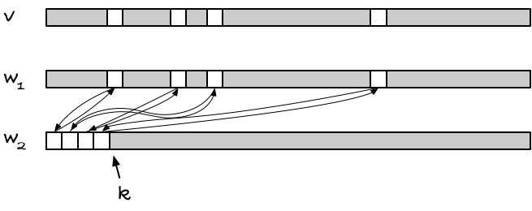

+++
title = "'Witness' arrays"
date = 2021-09-15T07:59:33+02:00
tags = ["programming", "algorithms", "C"]
categories = ["Programming"]
+++


The other day I was reminded of an exercises we got first or second year when I studied computer science. It is a cool little trick, that I've never seen outside of that exercise, so I thought I'd share it.

## The exercise

The exercise was this (as far as I recall): Come up with an array-like data structure that you can initialise in worst-case O(1), and after that you can assign to indices `v[i] = val` for `i` in some range 0 to `N` also in worst-case O(1), and you can access indices, `v[i]`, in worst-case O(1), where you should get the last value you assigned to that index, or some `UNDEFINED` value if you have never assigned to that index before.

It sounds simple enough until you try to do it. It is essentially just an array. You can update and access in constant time for arrays. The tricky part is that you should also *initialise* it in constant time. If you just leave the memory as it is when you allocate a chunk of memory, it can look like anything. If you see an `UNDEFINED` value, you can safely assume that it is `UNDEFINED`, because it would be a stupid system that would let you treat the same value as both meaning defined and undefined, but if you see any other value, you can never know if you have a valid value, or if you are looking at some uninitialised memory that looks like valid data.

The straightforward solution would require you to set all the entries in the array to `UNDEFINED` as part of the initialisation, and that would take O(n).

## Could we use hash tables?

A hash table would almost get you there. If you initialise it with some constant size, and then grow it as needed, you get O(1) initialisation and expected O(1) access. However, that is *amortised* and *expected* constant time. That is good enough for practically all applications, but it is not good enough for this exercise. We need *worst-case* constant time.

## Using another array as a witness

Let's say we have our array `v` and we don't know which entries in it are valid, and which are undefined. Maybe we could use another array, `w`, as a witness for `v`, telling us whether index `i` holds a value. So we could program access something like:

```c
struct witness_array {
    int v[N];  // values
    bool w[N]; // witnesses
};


int wa_get(struct witness_array *wa, int i) {
    return wa->w[i] ? wa->v[i] : UNDEFINED;
}
```

(I'll just use a static size here, `N`, but of course it could vary at runtime).

The problem with this approach is the same as with initialising the vector in the first place. If `w` isn't initialised, we have no way of trusting `w[i]`.

## Using *two* witnesses

Okay, that sucks, but what if we have a witness, `w2`, that can tell us if `w[i]` is valid?

Stop it, of course that gives you the same problem, just with three instead of two or one arrays.

But still...

If we have two witnesses arrays, `w1` and `w2`, we can let the value of `w1` at index `i`, `w1[i]`, tell us something about the validity of `x[i]`. In `w2` we can put witnesses for the valid indices in `w1`, but we don't necessarily have to put the witness for index `i` at `w2[i]`. We could put it at some other index, `j`. And if we know which indices in `w2` are valid some other way, we don't need a witness for that array. For example, if we knew that all indices less than `k` are valid, where `k` are the number of valid entries in `v`, then we wouldn't need more than that to know what to trust in `w2`.

It works like this. You keep track of how many valid indices there are, `k`. All indices `j` in `w2` are valid if `j < k`. That's the bookkeeping for `w2`; it tells you what you can trust there, but this doesn't let you index arbitrarily. When you are interested in `v[i]`, you are not much helped by what is valid in `w2`.

The `w1` array becomes the bridge between `v` with unknown valid indices and `w2` with known valid indices. The invariant is that `w1[i]`, if valid, points to an index `j` in `w2`, and `w2[j]` points back to `w1[i]`, i.e., `w2[j] = i`.

When you want to access index `i`, you can check if `w1[i]` is less than `k`. If it isn't, then it cannot be valid, because indices higher than `k` cannot be trusted in `w2`. But if it is, it could be valid, but we are not quite done yet; `w1[i]` could still be uninitialised and just randomly pointing at a `j < k`. We need to check with `w2` if it will vouch for the index, and it will if `w2[j] == i`.



So, the rule is: if `w1[i] < k && w2[w1[i]] == i`, then we have a valid index. When we look at indices smaller than `k`, `w2` is always valid, so if it points back at `w1[i]` it is a witness that `w1[i]` is valid. In that case, we can safely get `v[i]`.

When you assign to a previously uninitialised index, you need to increment `k` and set up the cyclic indices between `w1` and `w2`, and that is all the bookkeeping you need.

There is not much to implementing it. In C, it looks like:

```c
struct witness_array {
    int v[N];         // values
    int w1[N], w2[N]; // witnesses
    int k;            // no valid entries
};

struct witness_array *alloc_witness_array(void) {
    struct witness_array *wa = malloc(sizeof *wa);
    if (wa) { wa->k = 0; }
    return wa;
}

static inline bool wa_valid(struct witness_array *wa, int i) {
    return wa->w1[i] < wa->k && wa->w2[wa->w1[i]] == i;
}

static inline int wa_get(struct witness_array *wa, int i) {
    return wa_valid(wa, i) ? wa->v[i] : UNDEFINED;
}

static inline void wa_set(struct witness_array *wa, int i, int v) {
    if (!wa_valid(wa, i)) {
        wa->w1[i] = wa->k;
        wa->w2[wa->k++] = i;
    }
    wa->v[i] = v;
}
```


## Why would you use something like that?

You probably won't find many applications for it, because hash sets do the same thing with the same (although expected) running time, but if you want something like a bit vector, and you *really* want speedy access, this kind of array will get the job done for you (and you won't even have to use the array of values; the two witnesses are all you need).

You can think of it as a bit vector that is instantly initiated as `false`, and you only pay for the indices you set to `true`. So with a with a witness array, you save setting the initial values to `false`, what you would otherwise have to do.

Of course, for this to work, you need two arrays of size `sizeof(int) * N * CHAR_BIT` bits, compared to  just `N` bits, so memory wise it is not a good tradeoff. But you would get some speed if you need to represent a very sparse set.

The way `calloc()` is often implemented, memory mapping only the addresses you actually use, might still be faster, though. I haven't tested, and I don't have time to do it right now.

So, yeah, it might not be a data structure that is of much use in practise, but I hope you will agree that it is a neat idea.
